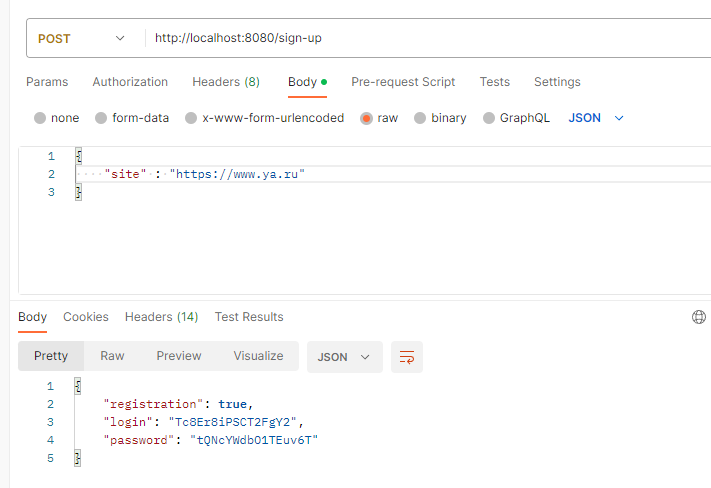
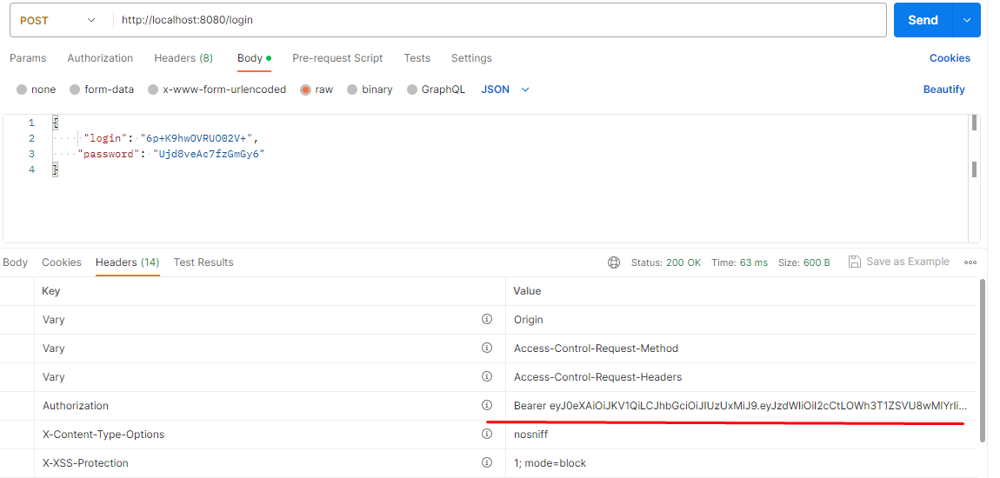
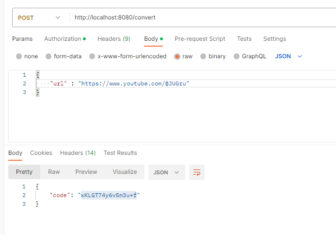
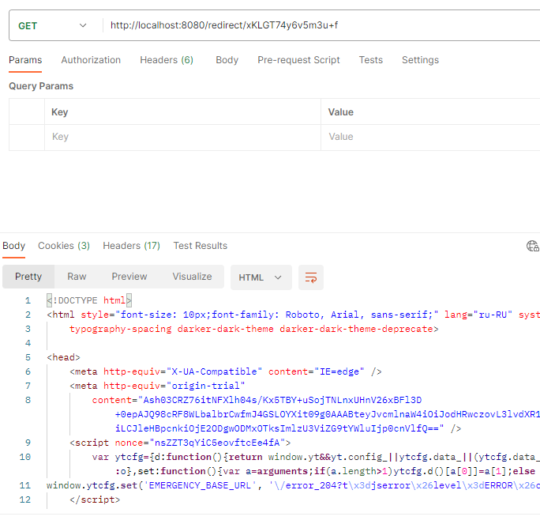
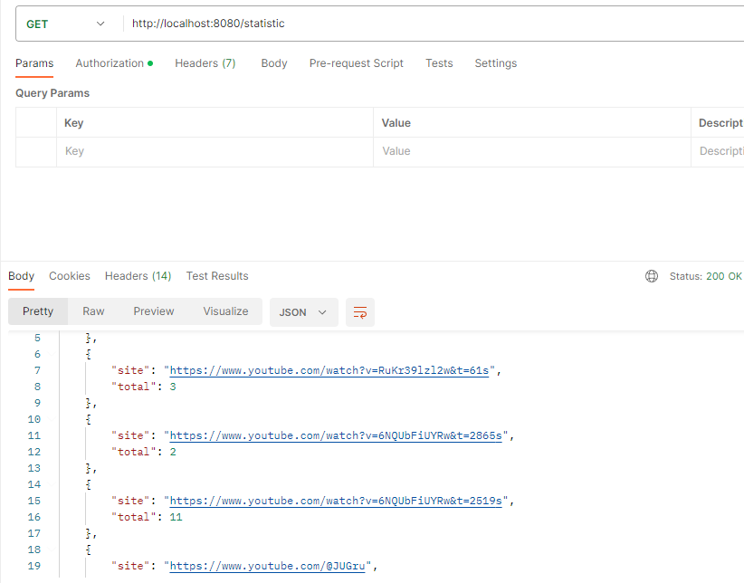

# URL_SHORTCUT

## Описание проекта
Rest API сервис сокращения ссылок. 
Пользователь регистрирует свой сайт в сервисе, после чего может получать сокращеннные ссылки на него.

## Стек Технологий
+ **JAVA 17**
+ **SPRING BOOT 2.7.11**
+ **SPRING DATA JPA 2.7.11**
+ **SPRING SECURITY 5.7.8**
+ **POSTGRESQL 14**
+ **LIQUIBASE 3.6.2**
+ **LOMBOK 1.18.26**
+ **JACOCO 0.8.8**

## Требования к окружению
+ **Java 17**
+ **Maven 3.8.6**
+ **Postgres 14**

## Запуск проекта

Создать базу данных с названием shortcut
```
create database shortcut;
```

Заменить данные подключения к БД.
Находятся по пути src/main/resources/application.properties
```
spring.datasource.url=jdbc:postgresql://127.0.0.1:5432/shortcut
spring.datasource.username=postgres
spring.datasource.password=password
spring.datasource.driver-class-name=org.postgresql.Driver
```

Выполнить инструкции из корня проекта
```
mvn clean install
mvn spring-boot:run
```

## Взаимодействие с приложением
**регистрация сайта** *POST:/sign-up*


**авторизация** *POST:/login*
Получаем JWT токен


**создание новой ссылки** *POST:/convert*


**переход на сайт по сокращённой ссылке** *GET:/redirect/{код полученный при создании новой ссылки}*
**метод доступен без авторизации**


**статистика вызовов сайтов** *GET:/statistic*


## Контакты
+ Telegram: @mouzzli